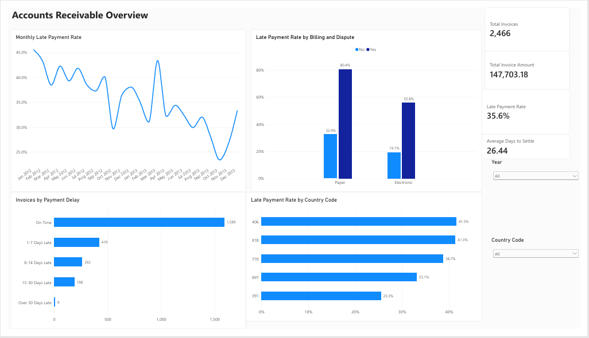
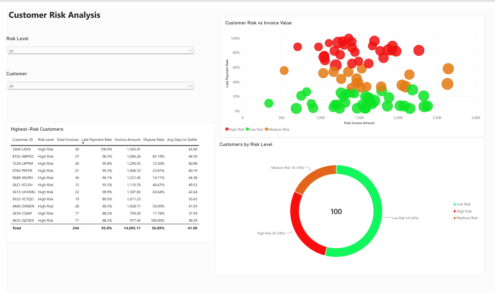

# Accounts Receivable and Customer Payment Analysis

An end-to-end financial data analysis project examining invoice settlement behaviour, late-payment risk, disputes, billing methods, and customer risk. The project combines Excel and Power Query for data preparation, MySQL for analysis, and Power BI for interactive reporting.

## Dashboard Preview

### Accounts Receivable Overview



### Customer Risk Analysis



## Business Problem

Late customer payments can reduce cash-flow predictability and increase collection costs. This project was designed to answer the following questions:

- What proportion of invoices are paid late?
- How does payment performance change over time?
- Are disputes and billing methods associated with late payment?
- Which payment-delay bands contain the most invoices?
- Which country codes and customers show the highest payment risk?
- Does invoice value appear to be a strong indicator of late-payment risk?

## Dataset

- 2,466 invoice records
- 100 customers
- 5 country codes
- 2012-2013 transaction period
- Key fields include invoice amount, invoice date, settlement date, days late, dispute status, billing method, customer ID, and country code

The source data does not define a currency or map the country codes to country names. For that reason, amounts are presented without a currency symbol and geographic results retain the original codes.

## Tools Used

- **Excel and Power Query:** data profiling, cleaning, type conversion, validation, and feature creation
- **MySQL:** KPI calculations, grouped analysis, CTEs, window functions, quartile analysis, and customer-risk view creation
- **Power BI:** data modelling, DAX measures, interactive filters, KPI cards, and dashboard development

## Data Preparation

The preparation process included:

1. Validating record counts, missing values, duplicates, invoice identifiers, and invoice amounts.
2. Correcting date types using the appropriate locale.
3. Standardising column names and categorical labels.
4. Creating payment status and payment-delay bands.
5. Creating a monthly reporting field and a numeric delay-band sort field.
6. Importing the cleaned data into MySQL and validating totals against Excel.
7. Building a date table and customer-level risk model in Power BI.

## Core KPIs

| KPI | Result |
|---|---:|
| Total invoices | 2,466 |
| Total invoice amount | 147,703.18 |
| Customers | 100 |
| Late invoices | 877 |
| Late-payment rate | 35.56% |
| Disputed invoices | 561 |
| Dispute rate | 22.75% |
| Average days to settle | 26.44 |
| Average delay among late invoices | 9.68 days |

## Key Findings

- **Disputes were the strongest observed risk indicator.** Disputed invoices had a 68.27% late-payment rate compared with 25.93% for non-disputed invoices.
- **Paper billing was associated with weaker payment performance.** Paper invoices had a 43.23% late-payment rate, compared with 27.51% for electronic invoices.
- **The combination of paper billing and disputes produced the highest risk.** Paper disputed invoices recorded an 80.35% late-payment rate, compared with 55.80% for electronic disputed invoices.
- **Most invoices were settled on time.** 1,589 invoices, or 64.44%, were on time. Only 8 invoices were more than 30 days late.
- **Country codes showed material differences.** Code 406 recorded the highest late-payment rate at 41.53%, followed closely by 818 at 41.34%.
- **Invoice value alone was not a strong risk indicator.** Late-payment rates across invoice-value quartiles were non-monotonic, ranging from 32.41% to 37.99%.
- **Customer risk was concentrated.** Twenty-eight customers were classified as high risk under the project rules.

These findings show associations in the available data and should not be interpreted as proof that a billing method or dispute caused late payment.

## Customer Risk Rules

The following project-specific thresholds were used for segmentation:

| Risk level | Late-payment rate |
|---|---:|
| High Risk | 60% or higher |
| Medium Risk | 30% to below 60% |
| Low Risk | Below 30% |

These thresholds are analytical rules created for this project, not universal credit-risk standards.

## Recommendations

1. Prioritise disputed invoices for early investigation and resolution.
2. Encourage customers to move from paper to electronic billing where appropriate.
3. Use the high-risk customer list to focus collection activity and account reviews.
4. Monitor codes 406 and 818 more closely while avoiding assumptions about their geographic meaning.
5. Track payment behaviour monthly and investigate sudden increases in late-payment rates.
6. Combine payment history, dispute behaviour, and billing method when assessing risk rather than relying on invoice value alone.

## Repository Contents

```text
Accounts_Receivable_Payment_Analysis/
|-- README.md
|-- Accounts_Receivable_Payment_Analysis.pbix
|-- Accounts_Receivable_Payment_Analysis_Dashboard.pdf
|-- Accounts_Receivable_Analysis.xlsx
|-- AR_Payment_Analysis.sql
|-- ar_transactions_clean.csv
`-- images/
    |-- ar_overview.png
    `-- customer_risk.png
```

## Dashboard Features

- Monthly late-payment trend
- Late-payment comparison by billing method and dispute status
- Payment-delay distribution
- Country-code comparison
- Year and country-code filters
- Customer-level scatter analysis
- Customer risk segmentation
- Highest-risk customer table

## Limitations

- Currency was not supplied in the source data.
- Country codes were not mapped to named countries.
- Risk categories are descriptive project rules rather than a predictive credit model.
- The analysis identifies relationships in historical data but does not establish causality.

## Author

**Mitchell Wambui Wangui**  
Accounting and Data Analytics Portfolio Project
